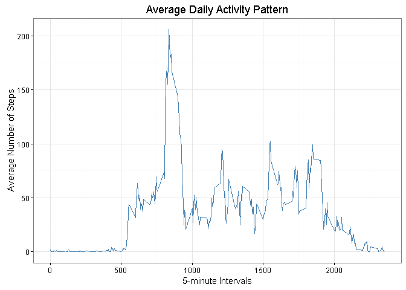

# Reproducible Research: Peer Assessment 1


## Loading and preprocessing the data

We assume the Dataset is already download and available to use, if its still in the ZIP format we unzip it using the R unzip method. The CSV is then read into *data* variable.


```r
dataFileName <- './activity.csv'
if(!file.exists(dataFileName)) {
  unzip('./activity.zip', exdir = '.', unzip = 'internal', overwrite = TRUE)
}

activityData <- read.csv(dataFileName)

# convert Date String values to as.Date() value
activityData$date <- as.Date(activityData$date)
```

## What is mean total number of steps taken per day?

```r
library(ggplot2)

stepsPerDay <- aggregate(steps~date, activityData, sum, na.action=na.pass, na.rm=TRUE)
plot1 <- ggplot(stepsPerDay, aes(x=steps)) +
  geom_histogram(binwidth = 1000, color="black", fill = "steelblue") +
  theme_bw(base_size = 11, base_family = "") + 
  labs(x="Steps", 
       y="Count", 
       title="Total number of steps taken Per Day")

print(plot1)
```

<!-- -->

```r
meanStepsPerDay <- mean(stepsPerDay$steps)
medianStepsPerDay <- median(stepsPerDay$steps)
```

Mean Steps per Day are 9354.2295.

Median Steps per Day are 10395.0000.


## What is the average daily activity pattern?


```r
averageDailyActivity <- aggregate(x=list(steps=activityData$steps), 
                                  by=list(interval=activityData$interval),
                                  mean, na.action=na.pass, na.rm=TRUE)
plot2 <- ggplot(averageDailyActivity, aes(x=interval, y=steps)) + 
  geom_line(color = "steelblue") +
  theme_bw(base_size = 11, base_family = "") + 
  labs(x="5-minute Intervals", 
       y="Average Number of Steps", 
       title="Average Daily Activity Pattern")


print(plot2)
```

<!-- -->

```r
intervalWithMaxSteps <- averageDailyActivity[which.max(averageDailyActivity$steps),]
```

Interval 835  on average across all the days in the dataset, contains the maximum number of steps, 206.1698113.

## Imputing missing values


```r
missingValues <- is.na(activityData$steps)
```

Total Number of missing values are 2304


We will replace each missing value with the mean of the 5-minute interval.

```r
fill.value <- function(steps, interval) {
    filled <- NA
    if (!is.na(steps))
        filled <- c(steps)
    else
        filled <- (averageDailyActivity[averageDailyActivity$interval==interval, "steps"])
    return(filled)
}
filledActivityData <- activityData
filledActivityData$steps <- mapply(fill.value, filledActivityData$steps, filledActivityData$interval)
```

Now using the filledActivityData we plot the histogram and compute the mean and median:


```r
stepsPerDayForFilled <- aggregate(steps~date, filledActivityData, sum, na.action=na.pass, na.rm=TRUE)
plot3 <- ggplot(stepsPerDayForFilled, aes(x=steps)) +
  geom_histogram(binwidth = 1000, color="black", fill = "steelblue") +
  theme_bw(base_size = 11, base_family = "") + 
  labs(x="Steps", 
       y="Count", 
       title="Total number of steps taken Per Day For Filled Data")

print(plot3)
```

<!-- -->

```r
meanStepsPerDayForFilled <- mean(stepsPerDayForFilled$steps)
medianStepsPerDayForFilled <- median(stepsPerDayForFilled$steps)
```

Mean Steps per Day are 10766.1887.

Median Steps per Day are 10766.1887.

Both Mean and Median values are higher, reason begin in the original data, there were days with NA step values, hence resulting the total steps for these days as 0. Onces there values were replaced with the average 5-minute interval value, the number of 0s dropped and inventually increasing the mean and median number of steps.

## Are there differences in activity patterns between weekdays and weekends?


```r
filledActivityData$DayType <- format(filledActivityData$date, "%u") %in% c(6, 7)
filledActivityData$DayType[filledActivityData$DayType == FALSE] <- "Weekday"
filledActivityData$DayType[filledActivityData$DayType == TRUE] <- "Weekend"

averagePerIntervalPerDaytype <- aggregate(steps ~ interval + DayType, data = filledActivityData, mean)

plot4 <- ggplot(averagePerIntervalPerDaytype, aes(interval, steps)) + 
  geom_line(color = "steelblue") +
  facet_grid(DayType ~ .) + 
  theme_bw(base_size = 11, base_family = "") + 
  labs(x="5-minute Intervals", 
       y="Average Number of Steps", 
       title="Average Daily Activity Pattern For Weekend and Weekdays")

print(plot4)
```

<!-- -->
